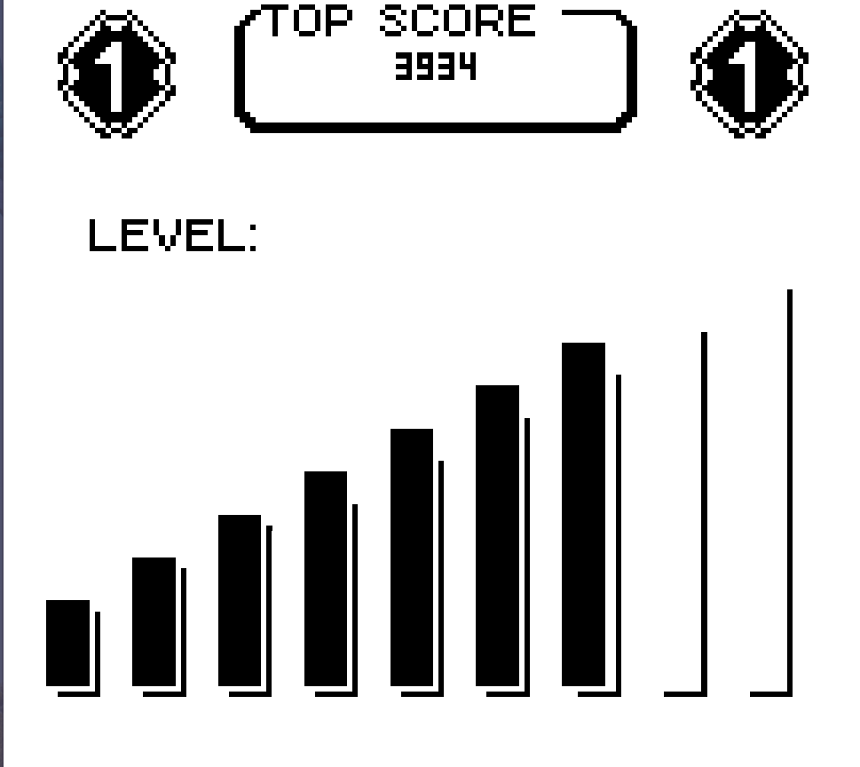
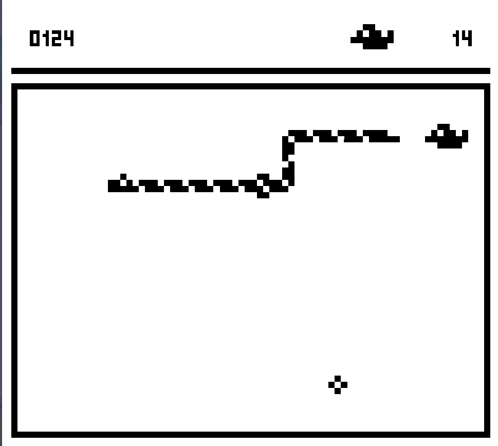

A Snake II clone for the Game Boy made with [GBDK-2020](https://github.com/gbdk-2020/gbdk-2020).

 
 
## How to Build
Export the path to your GBDK folder `export GBDK_HOME="/home/${USER}/GBDK/"` or define it in the Makefile.
Use `make`to compile the binary.

## License
This project is licensed under the terms of the GNU GPLv3 license.
